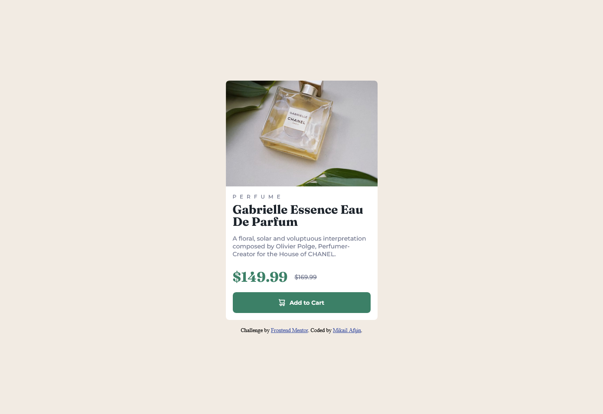
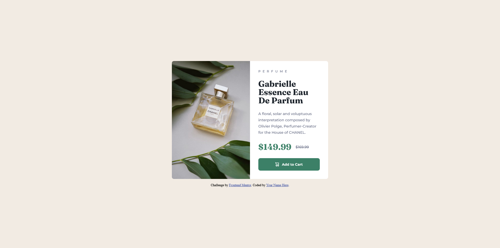

# Frontend Mentor - Product preview card component solution

This is a solution to the [Product preview card component challenge on Frontend Mentor](https://www.frontendmentor.io/challenges/product-preview-card-component-GO7UmttRfa).

## Table of contents

- [Overview](#overview)
  - [The challenge](#the-challenge)
  - [Screenshot](#screenshot)
  - [Links](#links)
- [My process](#my-process)
  - [Built with](#built-with)
  - [What I learned](#what-i-learned)
  - [Continued development](#continued-development)
- [Author](#author)

## Overview

### The challenge

Users should be able to:

- View the optimal layout depending on their device's screen size
- See hover and focus states for interactive elements

### Screenshot

**Mobile**

**Desktop**


### Links

- Solution URL: [GitHub]()
- Live Site URL: [Vercel]()

## My process

### Built with

- HTML5 markup
- CSS custom properties
- Flexbox
- Mobile-first workflow

### What I learned

For this challenge I used an approach I've never used before. That approach was to ensure responsiveness. So what did I do? I added the mobile view image to the HTML structure. Then, I set the `display` property of the img tag that I added to the html structure for the mobile view to `none`. Then, I added the desktop image to the desktop view with the help of CSS and the `background-image` property to ensure responsiveness.

```html
<div class="card-img">
  
</div>
```
```css
.card-img img {
  display: none;
}

.card-img {
  background-image: url(../images/image-product-desktop.jpg);
  background-repeat: no-repeat;
  background-position: center;
  background-size: cover;
}
```

### Continued development

In future projects I will try to focus on the responsive images. I feel like I don't have full control over responsive images. That's why I will strive to improve and perfect it.

## Author

- Frontend Mentor - [@mikailafsin](https://www.frontendmentor.io/profile/mikailafsin)
- Instagram - [@mikail.afsin](https://www.instagram.com/mikail.afsin)